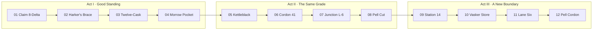

# Campaign site map and script index

The campaign follows one playable twelve-site route across three acts. Every site binds narrative,
enemy level, five authored waves, a vertical map, enemy routes, construction resources, and
reference defenses.

```mermaid
flowchart LR
  subgraph A1[Act I · Good Standing]
    S01[01 Claim 8-Delta] --> S02[02 Harker's Brace]
    S02 --> S03[03 Twelve-Cask]
    S03 --> S04[04 Morrow Pocket]
  end
  subgraph A2[Act II · The Same Grade]
    S05[05 Kettleblack] --> S06[06 Cordon 41]
    S06 --> S07[07 Junction L-6]
    S07 --> S08[08 Pell Cut]
  end
  subgraph A3[Act III · A New Boundary]
    S09[09 Station 14] --> S10[10 Vasker Store]
    S10 --> S11[11 Lane Six]
    S11 --> S12[12 Pell Cordon]
  end
  S04 --> S05
  S08 --> S09
```

## Route table

|   # | Site           | Code    | Region                | Enemy level | Defense binding                             | Narrative job                                                                                           |
| --: | -------------- | ------- | --------------------- | ----------: | ------------------------------------------- | ------------------------------------------------------------------------------------------------------- |
|   1 | Claim 8-Delta  | RAT-08D | Long Rake Verge       |          20 | Free placement on one readable route        | Establish licensed Ratter work, remote cutter operation, and the first unexplained telemetry hush.      |
|   2 | Harker’s Brace | RAT-HB4 | Long Rake Verge       |          21 | Wall and ceiling coverage across elevation  | Recover a brine seam; Surveyor makes first contact after coherent off-boundary timing appears.          |
|   3 | Twelve-Cask    | RAT-12C | Caskward Drift        |          22 | Finite capacity, area fire, and control     | Recover wet oxidizer; Buyer requests the discard fraction while Surveyor requests its phase history.    |
|   4 | Morrow Pocket  | IND-MP7 | Morrow Spur           |          23 | First open multi-route defense              | Complete the first independent mixed-grade claim and discover that separated fractions share one grade. |
|   5 | Kettleblack    | IND-KB2 | Kettleblack Drifts    |          24 | Persistent room graft                       | Mark dark grains across a split field; force Surveyor to offer a direct meeting.                        |
|   6 | Cordon 41      | DC-C41  | Outer Pell Approach   |          25 | Vertical specialists and support fields     | Reveal Vela Norr and recover a sensor wall that occupies both sides of its cordon.                      |
|   7 | Junction L-6   | CM-L06  | Pell Freight Lattice  |          26 | Separated freight lanes and target priority | Reveal Daro Venn, qualify industrial feed rates, and schedule the synchronized scale test.              |
|   8 | Pell Cut       | CM-PC9  | Pell Freight Lattice  |          27 | Four-array synchronized assault             | Run Coremark’s parallel arrays; trigger the Pell emergence and the first voice-like distress signal.    |
|   9 | Station 14     | DC-S14  | Pell Emergency Cordon |          28 | Flyers and split-height ingress             | Introduce Kethra and Soft Wake, recover cordon buoys, and designate the Near Voice.                     |
|  10 | Vasker Store   | DC-VS3  | Pell Emergency Cordon |          29 | Overlapping rooms and alternating columns   | Recover quiet-glass precursors and closure mass from spatially overlapping storage rooms.               |
|  11 | Lane Six       | DC-L06  | Pell Inner Cordon     |          30 | Compressed multi-route convoy cadence       | Bring Dern into direct command, secure the final approach, and authorize closure.                       |
|  12 | Pell Cordon    | DC-PELL | Pell Emergence        |          31 | Full campaign defense vocabulary            | Break the Near Voice’s learned cadence, close the newborn boundary, and recover the cordon.             |

Enemy level belongs to the site rather than the enemy type. Each spawn receives the site's baseline
unless its wave applies an authored offset. The same creature remains recognizable across the route
while health and other level-derived attributes follow the campaign curve.

## Act pacing

| Act            | Sites | Player status                                                          | Primary question                                                                 | Exit event                                                                        |
| -------------- | ----- | ---------------------------------------------------------------------- | -------------------------------------------------------------------------------- | --------------------------------------------------------------------------------- |
| Good Standing  | 1–4   | Licensed crew moving into independent claims                           | Why do two private patrons value different records from the same extraction?     | Kettleblack coordinates test whether the cutter crosses or moves a boundary.      |
| The Same Grade | 5–8   | Independent operator caught between Council caution and Coremark scale | Can remote reach protect people when the process itself relates distant sites?   | Pell Cut stabilizes into an active emergence using the foundry’s learned cadence. |
| A New Boundary | 9–12  | Contracted Council containment asset                                   | Can the crew turn the method that formed the boundary into a closure instrument? | Pell closes and the full cordon returns.                                          |

## Briefing pattern

The pre-mission sequence keeps story and mechanics in a fixed order:

1. **Act introduction:** the first site of each act opens with exactly two setting paragraphs. The first establishes the crew’s circumstances; the second explains what has changed and where the act begins.
2. **Contract conversation:** the site, employer, and practical job appear before the call. The comm then presents one speaker portrait and one complete dialogue turn at a time. The player advances each turn and explicitly opens the mission briefing after the final line.
3. **Operational briefing:** the site name, route forecast, construction resources, current assault objective, field-guidance choice, and build control appear together after the conversation. This copy remains under the site's localized level keys.

The intermission uses the same talking-head treatment for the after-action call. Each turn reports a concrete result or observation, and the last turn advances one reveal while remaining visible beside the travel controls.

## Dialogue allocation

| Site           | Briefing speakers               | Debrief speakers               | Story movement                                                  |
| -------------- | ------------------------------- | ------------------------------ | --------------------------------------------------------------- |
| Claim 8-Delta  | Malk, Mavo, T’kesh              | Malk, T’kesh                   | Establish crew competence and anomaly.                          |
| Harker’s Brace | Malk, Mavo, T’kesh              | Surveyor, T’kesh               | First mysterious request.                                       |
| Twelve-Cask    | Malk, Surveyor, Buyer           | T’kesh, Buyer, Surveyor        | Establish competing interests in the same sample.               |
| Morrow Pocket  | Malk, Surveyor, Buyer           | T’kesh, Mavo, Surveyor         | State the single-grade insight and point to Kettleblack.        |
| Kettleblack    | Surveyor, Buyer, T’kesh         | Mavo, Rig Telemetry, Surveyor  | Prove split boundaries and earn Surveyor’s identity.            |
| Cordon 41      | Vela, Vela, Mavo                | Vela, T’kesh, Rig Telemetry    | Reveal Council motive and trace Buyer.                          |
| Junction L-6   | Daro, Daro, Malk                | Daro, Vela, T’kesh             | Reveal Coremark motive and commit to scale.                     |
| Pell Cut       | Daro, Vela, T’kesh              | Rig Telemetry, Malk, Vela      | Create the emergency.                                           |
| Station 14     | Kethra, Kethra, Soft Wake       | Mavo, Soft Wake, Rig Telemetry | Establish containment team and name Near Voice.                 |
| Vasker Store   | Vela, Soft Wake, Mavo           | Vela, T’kesh, Kethra           | Build the closure method and expose Near Voice’s tracking rule. |
| Lane Six       | Kethra, Dern, Soft Wake         | Kethra, Vela, Dern             | Assign final authority and stakes.                              |
| Pell Cordon    | Dern, Kethra, Soft Wake, T’kesh | Dern, Kethra, Vela, Daro       | Close Pell and record consequences.                             |

The canonical English script is [`src/localization/locales/en/narrative.ts`](../../src/localization/locales/en/narrative.ts). Dialogue definitions contain only stable speaker and line IDs in [`src/game/content/narrativeCampaign.ts`](../../src/game/content/narrativeCampaign.ts), allowing every locale to translate or reshape sentence rhythm without changing campaign state.

## Map presentation rules

- Secured sites show their name and completed route segment.
- The active site shows its name and highlighted marker.
- The next site reveals after its predecessor becomes active.
- Later sites appear as pending markers, preserving the Pell and Council escalation.
- Act names may appear once the active site belongs to that act.
- Map geometry is normalized from 0–100 and carries no simulation coordinates.

## Encounter functions

1. Claim 8-Delta establishes free surface placement, direct fire, one route, and one upgrade.
2. Harker’s Brace makes mounting face, elevation, firing arc, and line of sight visible.
3. Twelve-Cask introduces finite tower capacity, area fire, route control, and mixed cadence.
4. Morrow Pocket opens the defense across multiple routes and removes click-by-click guidance.
5. Kettleblack introduces a costly persistent room graft that changes final-approach geometry.
6. Cordon 41 tests flyers, ladder specialists, armor, and shared protection in a vertical stack.
7. Junction L-6 separates freight lanes and makes support targeting and sustained capacity matter.
8. Pell Cut defends four synchronized arrays as the Act II escalation.
9. Station 14 foregrounds flyers, split-height coverage, and multiple ingress routes.
10. Vasker Store alternates fast, heavy, upper-lane, and supported columns through overlapping rooms.
11. Lane Six compresses convoy cadence across a long multi-route approach.
12. Pell Cordon combines placement, routing, targeting, graft, and support decisions while the
    foundry breaks the Near Voice’s learned cadence.
